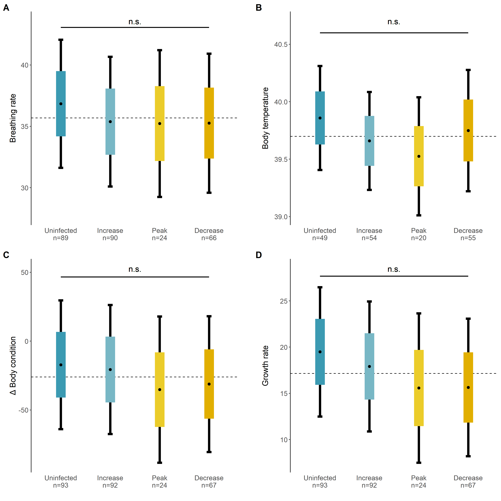
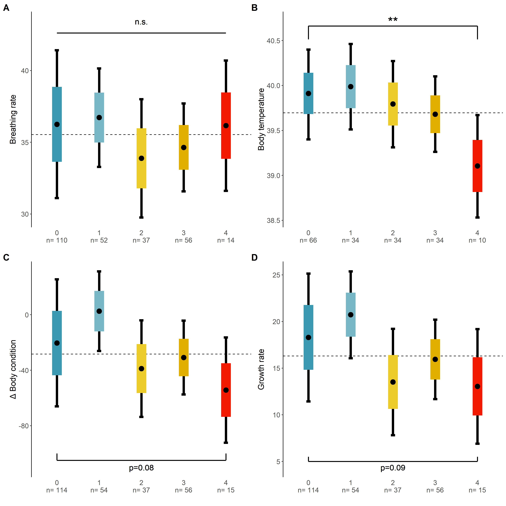

# Code to analyze the effect of blood parasite infections on physiology of raptor nestlings. 

-   **MS_***.Rmd** contains the code for all analyses of this manuscript. In addition, we
    provide our data files in the folder called `data`, which should be
    placed in a subfolder of the working directory in order to repeat
    analyses.

## **`data`**

This folder contains raw data and results of our analysis. The raw data
files are listed below.

-   **physiology_infection_stage_full_wideformat.csv** contains individual specific data

