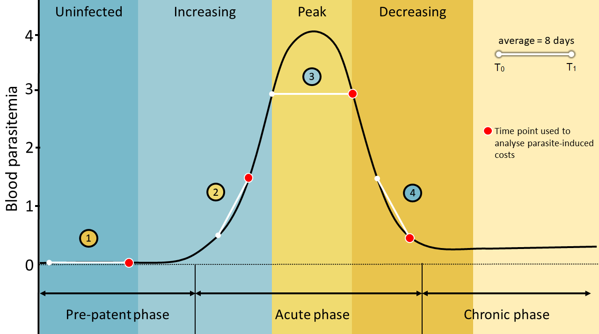
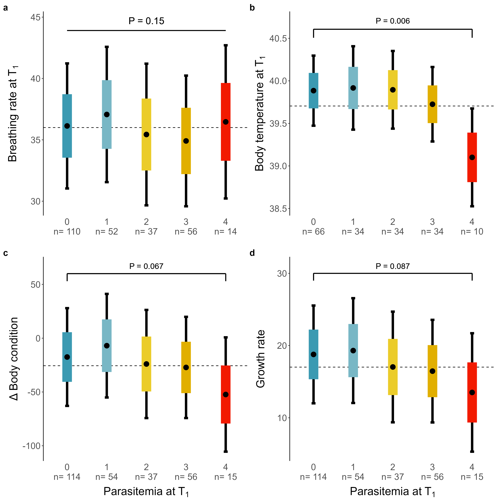

# Code to analyze the effect of blood parasite infections on physiology of raptor nestlings. 

-   **MS_physiology_infection.Rmd** contains the code for all analyses of this manuscript. In addition, we
    provide our data file.
    
-   **MS_physiology_infection.html** display the code for all analyses of this manuscript.

-   **physiology_infection_stage_full_wideformat.csv** is the data file that contains individual specific data

-   **Legend columns data.txt** explains the meaning of the columns in **physiology_infection_stage_full_wideformat.csv**

-   **Repeatability_temperatures.csv** contains repeated body temperatures measures

-   **Figs**, a folder with all the figures displayed in the manuscript

-   **Tables**, a folder with all the tables displayed in the manuscript, in html format.

